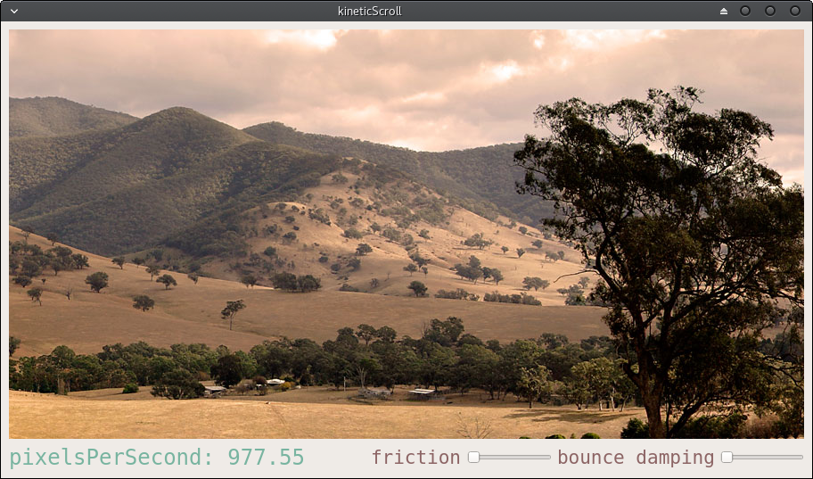

# sortDemo
Kinetic scroll in Qt.

See full description at [angelobacchini.github.io](https://angelobacchini.github.io/software%20projects/kinetic-scroll-in-qt)
---
### build
Builds with Qt 5.9.1
Build with 

        qmake kineticScroll.pro
        make

or just open kineticScroll.pro in QtCreator.
---
